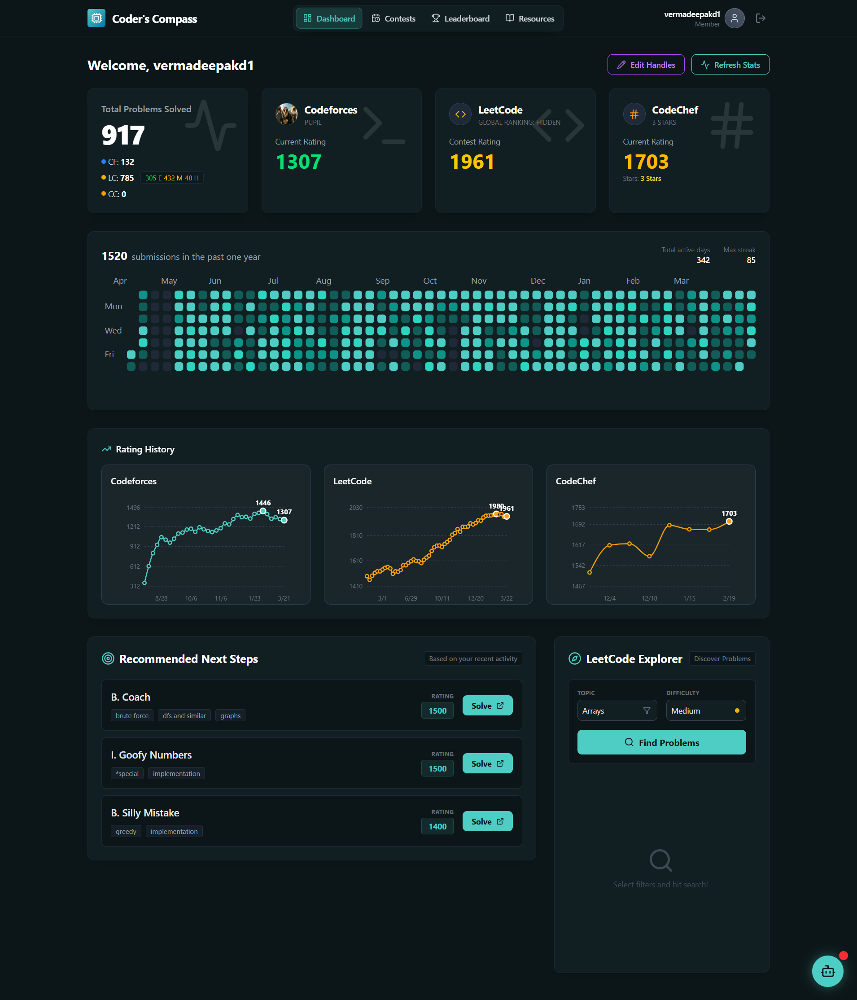

# 🧭 Coder's Compass

**Navigate Your Path to Coding Mastery**

A smart progress tracker and AI-powered coach for competitive programmers.
**Live Demo:** [https://coders-compass.vercel.app](https://coders-compass.vercel.app)



## 🚀 Key Features

- **Multi-Platform Tracking**: Aggregates real-time stats from **Codeforces** and **LeetCode** into a single dashboard.
- **AI Coach**: Integrated **Google Gemini AI** to provide context-aware hints without revealing code solutions.
- **Unified Heatmap**: A GitHub-style activity graph merging submission history from multiple platforms.
- **Smart Caching**: Implemented **Redis** caching strategy to reduce external API latency by 90% and save AI quotas.
- **System Design**: Protected by **Rate Limiting** and **JWT Authentication** for production-grade security.
- **Rating History Graphs**: Interactive graphs tracking your contest ratings over time.
- **Problem Explorer**: Filter and find LeetCode problems by tag and difficulty.

## 🔮 Coming Soon

- **CodeChef Integration**: Track your CodeChef ratings and stars.
- **Contest Reminders**: Get notified about upcoming contests via email or push notifications.
- **Friend Leaderboards**: Add friends and compete on custom leaderboards.
- **Topic Strength Analysis**: Detailed breakdown of your strong and weak topics (e.g., DP, Graphs, Greedy).

## 🛠️ Tech Stack

- **Frontend**: React.js, Vite, Tailwind CSS, Recharts, React Calendar Heatmap
- **Backend**: Node.js, Express.js
- **Database**: MongoDB Atlas (User Data), Upstash Redis (Caching)
- **AI Integration**: Google Gemini AI
- **External APIs**: LeetCode GraphQL API, Codeforces API
- **Deployment**: Vercel (Frontend), Render (Backend)

## ⚙️ Architecture

The application follows a client-server architecture with a centralized proxy for API management and caching.

```text
Client (React)
      │
      ▼
Proxy Server (Node.js/Express)
      │
      ├───► Redis Cache (Upstash)
      │
      ├───► Codeforces API
      │
      ├───► LeetCode GraphQL API
      │
      └───► Google Gemini AI
```

## 📦 Installation & Setup

Follow these steps to set up the project locally.

### Prerequisites

- Node.js (v16 or higher)
- MongoDB (Local instance or MongoDB Atlas)
- Redis (Optional, but recommended for caching)
- API Keys for Google Gemini

### 1. Clone the Repository

```bash
git clone https://github.com/Vermadeepakd1/coders-compass.git
cd coders-compass
```

### 2. Backend Setup

Navigate to the server directory and install dependencies:

```bash
cd server
npm install
```

Create a `.env` file in the `server` directory with the following variables:

```env
PORT=5000
MONGO_URI=your_mongodb_connection_string
JWT_SECRET=your_jwt_secret_key
GEMINI_API_KEY=your_google_gemini_api_key
REDIS_URL=your_redis_connection_string
```

Start the backend server:

```bash
npm start
# or for development with nodemon
npm run dev
```

### 3. Frontend Setup

Navigate to the client directory and install dependencies:

```bash
cd client
npm install
```

Create a `.env` file in the `client` directory:

```env
VITE_API_URL=http://localhost:5000
```

Start the development server:

```bash
npm run dev
```

The application should now be running at `http://localhost:5173`.

## 🤝 Contribution Guidelines

We welcome contributions from the community! Whether it's fixing bugs, adding new features, or improving documentation, your help is appreciated.

1.  **Fork the Project**: Click the "Fork" button at the top right of this page.
2.  **Clone your Fork**: `git clone https://github.com/YOUR_USERNAME/coders-compass.git`
3.  **Create a Feature Branch**: `git checkout -b feature/AmazingFeature`
4.  **Commit your Changes**: `git commit -m 'Add some AmazingFeature'`
5.  **Push to the Branch**: `git push origin feature/AmazingFeature`
6.  **Open a Pull Request**: Go to the original repository and open a PR describing your changes.

### Code Style

- Please ensure your code follows the existing style (ESLint configuration provided).
- Use meaningful variable and function names.
- Comment your code where necessary.

## 📞 Contact & Support

If you have any suggestions, doubts, or want to report a bug, please feel free to reach out.

**Email**: [vermadeepakd1@gmail.com](mailto:vermadeepakd1@gmail.com)

---

_Built with ❤️ by [Deepak Verma](https://github.com/Vermadeepakd1)_
